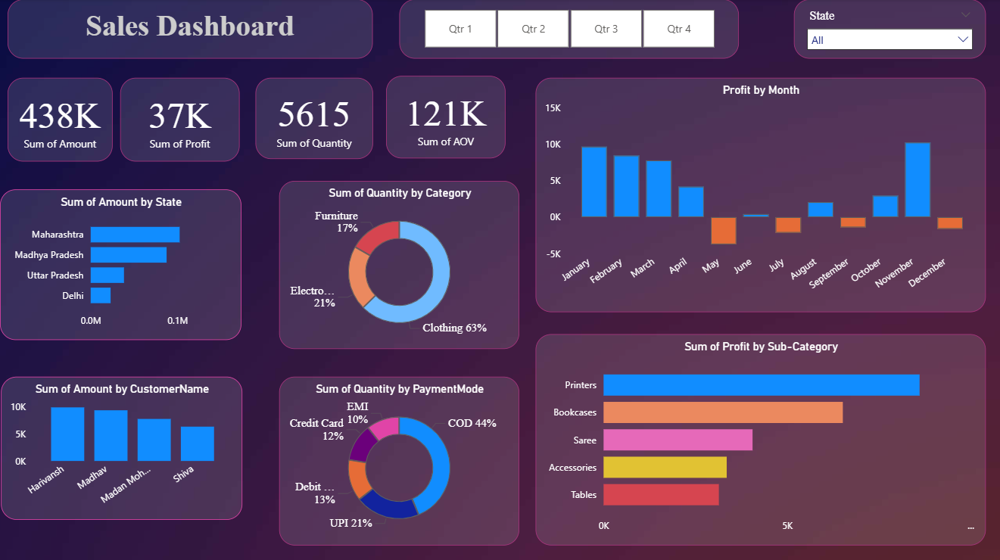

# 🏬 Retail Sales Performance Dashboard — Power BI

This interactive dashboard provides actionable insights into retail sales performance based on Excel data. It highlights customer spending, category trends, profit contribution, payment preferences, and state-wise business growth. The dashboard helps stakeholders monitor KPIs and make data-driven decisions.

---

### 📌 Objectives
- Track overall sales, profit, and order performance
- Compare state-wise revenue contribution
- Study category and sub-category profit distribution
- Analyze monthly trends for peak season planning
- Understand payment and customer behavior to improve strategy

---

### 📊 Key KPIs

| KPI | Description |
|-----|-------------|
| **Total Sales Amount** | Overall revenue generated |
| **Total Profit** | Net profit earned |
| **Total Quantity Sold** | Units sold across products |
| **Average Order Value (AOV)** | Revenue per transaction |

---

### 📈 Dashboard Insights
- Maharashtra leads in total sales contribution, followed by Madhya Pradesh.
- Clothing dominates category-wise sales, followed by Electronics & Furniture.
- December and January months show the highest sales volume.
- COD & UPI are the most preferred payment modes among customers.
- Printers & Bookcases contribute maximum profit in sub-category.

---

### 🖼️ Dashboard Preview

---

### 🧠 Tools & Techniques

| Feature | Used |
|--------|------|
| Data Source | Excel |
| Tool | Power BI |
| ETL | Power Query |
| Calculations | DAX Measures |
| Visuals | Bar, Donut, KPI Cards, Clustered Charts, State Comparison |

---

### 🗂 Files in this Repository

| File | Description |
|------|-------------|
| `Retail_Sales_Dashboard.pbix` | Power BI dashboard file |
| `Sales_Dashboard.PNG` | Dashboard preview image |
| `README.md` | Complete project documentation |

---

### ▶️ How to Use
1. Download the `.pbix` file
2. Open in Power BI Desktop
3. Refresh data if needed and interact with slicers

---

### 🔮 Future Enhancements
- Add customer segmentation metrics
- Perform regional forecasting using DAX/Power BI AI visuals
- Integrate SQL data source for automation

---

### 👨‍💻 Author  
**Rushabh Mishra**  
Data Analyst | Excel | Power BI | SQL | Python  

🔗 GitHub: https://github.com/CodeRush19  
🔗 LinkedIn: https://www.linkedin.com/in/rushabh-mishra-97a0991b7/

